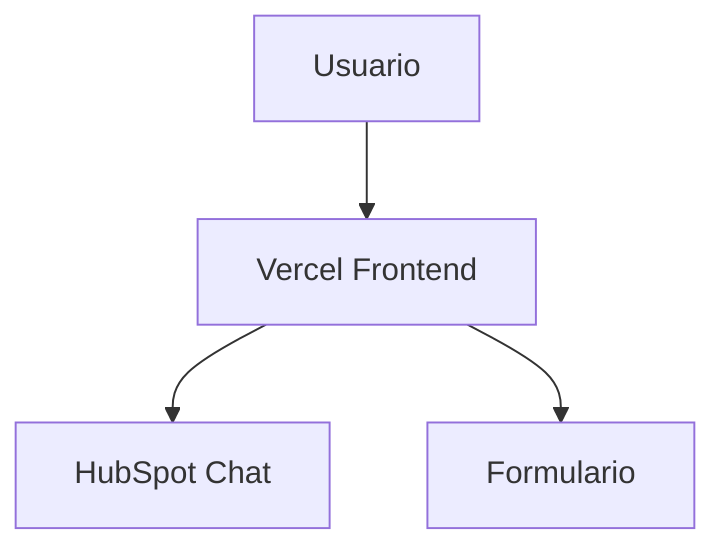
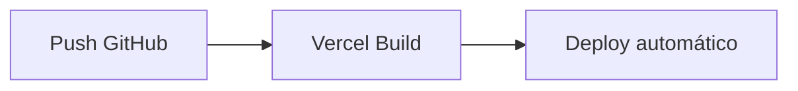
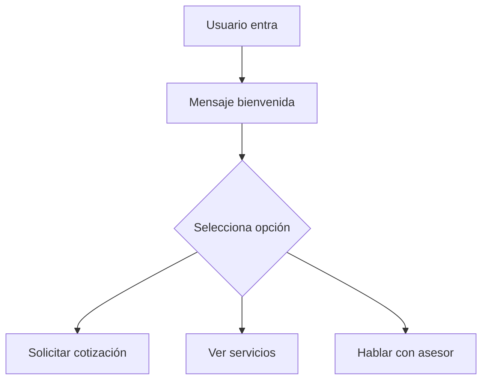
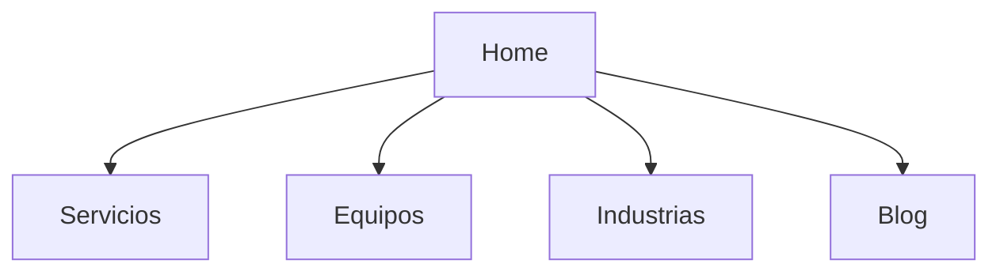

# 🚀 Guía Completa: Setup Demo 100% Gratis + Evolución (Metrología)

## 🎯 Objetivo
Montar un sitio web funcional sin costo que incluya:
- Frontend en Vercel
- Chat + CRM con HubSpot
- Deploy automático desde GitHub
- Base SEO para metrología
- Preparado para escalar a IA (Claude)

---

# 🧩 1. Arquitectura (Fase 0 - Gratis)



---

# 🐙 2. GitHub (Base del sistema)

## Crear cuenta
1. https://github.com
2. Sign up
3. Confirmar email

## Crear repo
- Nombre: metrologia-web
- Privado recomendado

## Subir proyecto
```bash
git init
git add .
git commit -m "init"
git branch -M main
git remote add origin https://github.com/TU_USUARIO/metrologia-web.git
git push -u origin main
```

---

# 🌐 3. Vercel (Frontend + hosting gratis)

## Crear cuenta
1. https://vercel.com
2. Login con GitHub

## Deploy
1. Add New Project
2. Seleccionar repo
3. Deploy automático

## Configuración
- Framework: Next.js recomendado
- Build: automático
- Output: automático

---

# 🔄 Deploy automático



---

# 💬 4. HubSpot (Chat + CRM GRATIS)

## Crear cuenta
1. https://hubspot.com
2. Get started free
3. Usar correo empresarial

---

## Crear Chatflow

1. Settings → Inbox → Chatflows
2. Create chatflow
3. Website chat

---

## Flujo recomendado



---

## Configuración paso a paso

### Mensaje inicial:
"Hola, ¿en qué podemos ayudarte sobre calibración?"

### Opciones:
- Solicitar cotización
- Equipos que calibramos
- Hablar con asesor

---

## Captura de leads
Activar:
- Email obligatorio
- Nombre
- Empresa

---

## Instalación en sitio

1. Settings → Tracking Code
2. Copiar script
3. Pegar antes de </body>

---

# 🧠 5. Formularios

## Recomendación
Sí usar HubSpot forms si:

- quieres CRM integrado
- seguimiento de leads
- automatización

## Implementación
1. Marketing → Forms
2. Create form
3. Embed en sitio

---

# 🌐 6. SEO Metrología

## Estructura



---

## URLs

- /calibracion-termometros
- /calibracion-manometros
- /calibracion-balanzas

---

## Keywords

- calibración de equipos industriales
- laboratorio de metrología México
- calibración certificada ISO

---

## Contenido clave
- páginas por equipo
- páginas por industria
- FAQs técnicas

---

# 🚀 7. Evolución de infraestructura

## Fase 0 (actual)
- Vercel (free)
- HubSpot (free)
- Sin backend

---

## Fase 1 (validación)
- tráfico > 500 visitas
- implementar backend simple

---

## Fase 2 (crecimiento)
- agregar Claude API
- RAG
- backend en VPS

---

## Fase 3 (escala)
- infraestructura distribuida
- CDN + backend robusto

---

# 🤖 8. Prompt para Claude Code

```text
Analiza el proyecto existente (React/Node).

Objetivos:
1. Adaptar el proyecto para correr en Vercel:
   - Convertir backend a funciones serverless si es necesario
   - Eliminar dependencias de servidores persistentes

2. Chatbot:
   - NO eliminar implementación actual con Claude
   - Comentar o desactivar temporalmente
   - Integrar HubSpot chat (script embed)

3. Formularios:
   - Analizar formulario actual
   - Determinar si conviene migrar a HubSpot Forms
   - Si es viable, implementar integración

4. SEO (metrología):
   - Optimizar headings (H1, H2)
   - Crear estructura por servicios/equipos
   - Mejorar metadata (title, description)
   - URLs amigables

5. Performance:
   - Optimizar carga
   - Lazy loading
   - minimizar JS

Output:
- Código listo para deploy en Vercel
- Cambios documentados
```

---

# 🔐 Buenas prácticas

- No subir API keys
- Usar variables entorno
- Repo privado
- Logs de interacción

---

# 🎯 Conclusión

Este setup permite:
- Lanzar demo inmediato
- Validar negocio
- Capturar leads
- Escalar sin rehacer arquitectura
